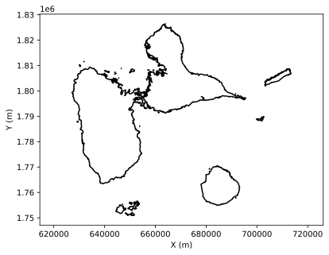
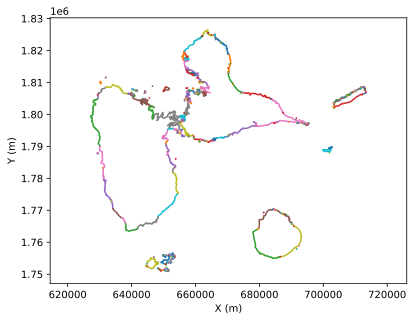
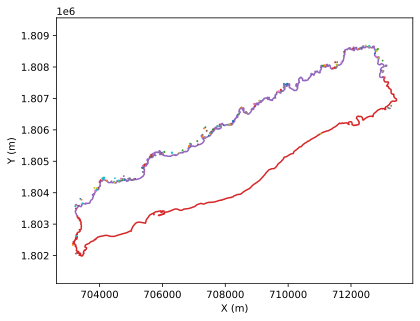
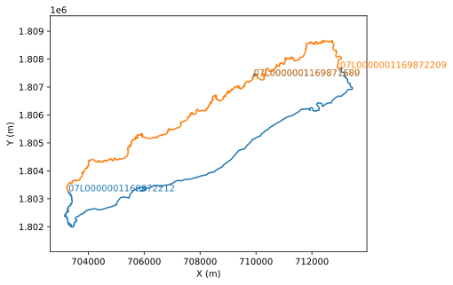
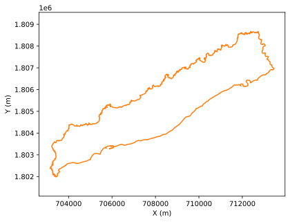

Extracting continuous contours from IGN shapefiles
===================================================

Problem
--------

The road to hell is paved with good intentions. The availability of IGN data is a wonderful source, but it comes at a price. The contour
of an island is made up of a myriad of small, independent contours with different orientations. For those like me who want to obtain a closed contour for their models, let's just say it: it's a real pain.

Example. Let's take Guadeloupe and the Saintes archipelago. Extracting the contours from the shapefile is simple and in monochrome representation:
Ah, it's beautiful! And incredibly precise!

Yes, but if we represent the contours in detail: argh, hundreds of segments...

We therefore need to reassemble the segments one by one to obtain a single contour. Below is the method I use, as well as a directory of available contours.

Method
-------

I start by defining x, y boundaries to remove the geographic areas I'm not interested in.
For Désirade, this looks like this:

.. code-block:: python

    fig, ax = plt.subplots(1)
    for key, val in lg.items():
        if min(val[0]) > 7e5 and min(val[1])>1.8e6:
            ax.plot(val[0], val[1])
    plt.xlabel("X (m)")
    plt.ylabel("Y (m)")
    plt.axis("equal")
    plt.savefig('../docs/figures/fig3.svg', bbox_inches='tight')

Then I filter by excluding the islets by looking for closed contours

.. code-block:: python

    fig, ax = plt.subplots(1)
    i = 0
    c = ['C0','C1']
    for key, val in lg.items():
        if min(val[0]) > 7e5 and min(val[1])>1.8e6:
            if val[0][0] != val[0][-1] and val[1][0] != val[1][-1]:
                ax.plot(val[0], val[1], color = c[i%2])
                ax.text(val[0][0], val[1][0], key, color = c[i % 2])
                i += 1
    plt.xlabel("X (m)")
    plt.ylabel("Y (m)")
    plt.axis("equal")
    plt.savefig('../docs/figures/fig4.svg', bbox_inches='tight')

In some cases (Grande Terre) where there are many remaining contours, I start with the longest and then work my way down.
Finally, I create a list of codes for the remaining contours that interest me. Once this list is created, I need to order the contours
so that they are only ordered once. This looks like this:

.. code-block:: python

    DesiradeList = ['07L0000001169872212','07L0000001169872209']
    ex={}
    for key, val in lg.items():     
        if key in DesiradeList:
            ex[key] = [val[0][0], val[1][0], val[0][-1], val[1][-1]]

    x,y = IGN_to_segment_v2(lg, DesiradeList, ex, plot_res=False)
    fig, ax = plt.subplots(1)
    ax.plot(x,y,'-', color='C1')
    plt.xlabel("X (m)")
    plt.ylabel("Y (m)")
    plt.axis("equal")
    plt.savefig('../docs/figures/fig5.svg', bbox_inches='tight')

And there you have it...

