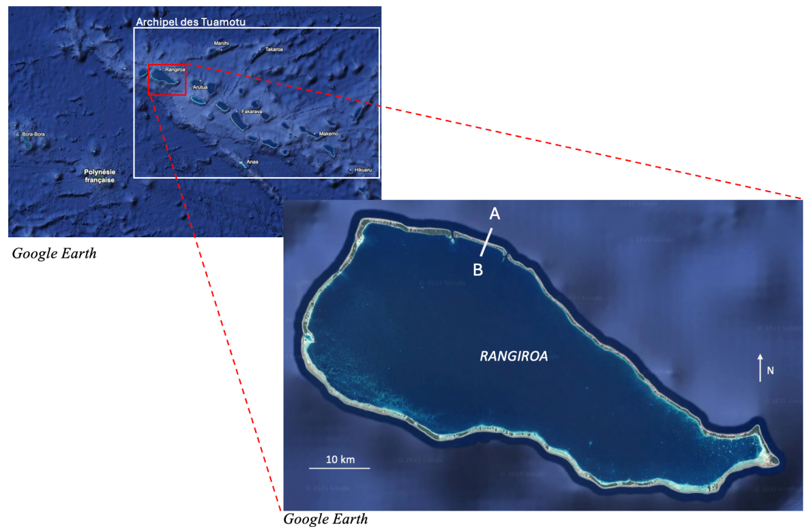
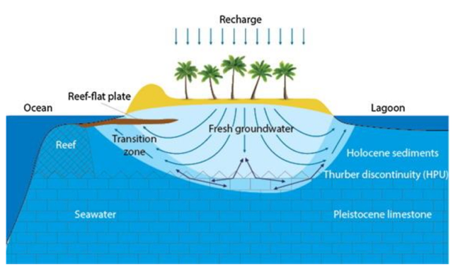

About IslandsLib
****************

What Islandslib is
==================

IslandsLib is a python library that provides a set of functions and classes to build a simple
2D model of and island's freshwater lense.

IslandsLib builds on the pyfreefem library and FreeFem++ software to  provide a simple function :func:`IslandLens()` 
to model freshwater lenses *without* a prior knowledge of Finite Element Modeling. 
Given a set of contour data and constraints if will model the freshwater lens of a *small* island. 
A *small* island is here defined as an island without a river network. 

Lakes can be included (see examples), and river networks will be included in  later versions of :func:`IslandLens`. If you want to solve problems with river networks 
you need to use the set of functions provided or to use pyFreeFem directly.

IslandsLib also providesfunctions to process  IGN (French National Geography Insitute) products.
Functions used for IGN products are meant to help you create single coastline contours from shapefile for the purpose of modeling the Poisson equation. 
They can also be used to extract elevations from DEMS for different purposes (defining boundary conditions in particular). 

Eventually IslandsLib also provides a repository of Island contours. Please feel free to contribute !

What IslandsLib is not
======================

**IslandsLib is not a Finite Element Model Solver** It relies on the pyFreeFem library developped by Olivier Devauchelle (https://github.com/odevauchelle/pyFreeFem) a python wrapper 
around the FreeFem++ Solver (https://freefem.org/). 
As such **both** pyFreeFem and FreeFem++ must be installed on your computer in order to use IslandsLib

**IslandsLib is not a Plug and Play IGN Data Converter** Functions are provided to help transform contours, especially those disclosed by the French Geographic Institute (IGN). The functions and procedures 
can be used with  basically any set of contours but they require a bit of work. 
An example of single contour création from in IGN shapefile is given

What are Freshwater Lenses and Why Bother for Them
==================================================

Origin of Island Freshwater: Example of Rangiroa, French Polynesia
------------------------------------------------------------------

An atoll is a ring-shaped island made up of a coral reef, built on the flanks of an ancient volcano and 
surrounding a lagoon. These unique geological formations rise only a few meters above sea level; 
they are therefore among the most vulnerable to sea level rise and extreme weather events.

We here use the example of Rangiroa to present the challenges associated with the supply of fresh water to 
these small islands. Rangiroa is the largest atoll in the Tuamotu archipelago of French Polynesia 
(Figure :ref:`fig-rangiroaloc`). The "island" of the atoll, in the case of Rangiroa, comprises 415 small coral islands 
called motus, of which only two are permanently inhabited. In 2017, its population represented 6% of the total 
inhabitants of French Polynesia, or 2,700 inhabitants :cite:p:`white2007challenges`. 

Atolls like Rangiroa face several constraints: low topography, lack of a hydrographic network, 
geographic isolation, and high climate variability. These conditions severely limit access to freshwater, 
which relies on rainwater harvesting, seawater desalination, and groundwater exploitation. However, desalination 
involves particularly high operating costs, while rainfall is marked by strong seasonality and sensitive to 
climate change. Groundwater therefore appears to be a key resource for securing freshwater supplies for island 
inhabitants. However, little is still known about this resource which is vulnerable to climate effects and human actions.

.. _fig-rangiroaloc:

    GoogleEarth image of the Tuamotu and Rangiroa archipelago

Freshwater Lens: a Fragile and Threatened Resource
--------------------------------------------------

Fresh groundwater comes from precipitation. This seeps into the porous coral reef soils and is temporarily 
stored beneath the island before flowing out into the ocean or lagoon. This fresh groundwater rests 
on the heavier salt water to form a lens (Figure :ref:`fig-atoll`), whose thickness 
varies from a few tens of centimeters to about ten meters :cite:p:`bailey2009numerical`. 
The contact zone between fresh and salt water constitutes a mixing zone between fresh and salt water, 
also called the transition zone or interface.

The shape of the lens depends on three factors: the width of the island, recharge (precipitation – evaporation) 
and hydraulic conductivity :cite:p:`werner2017hydrogeology`. The volume contained in the lens also depends on the 
porosity of the soil.
The balance of this lens is fragile: its shape and volume can be impacted by natural 
and anthropogenic phenomena. Indeed, the tides cause the water table to rise by hydrostatic pressure, 
increasing the mixing zone. The freshwater-saltwater interface can also rise following excessive extraction. Finally, 
rising sea levels would cause the freshwater-saltwater interface to rise by hydrostatic uplift, thus reducing 
the volume of freshwater stored in the lens. All these processes contribute to the phenomenon of aquifer 
salinization.

Sustainable management of these aquifers therefore represents a real challenge, 
particularly in the inhabited areas of these islands. It is crucial to determine the volume of 
freshwater available, and the impact of salinization on this volume, in order to develop sustainable 
extraction methods. To do this, it is necessary to estimate the stocks and flows of the lens, as well as 
their potential changes.

   

.. _fig-atoll:

    Cross section of an atoll :cite:p:`werner2017hydrogeology`

.. bibliography::

Modeling an Island's Freshwater Lens 
------------------------------------

Under certain conditions, the water table of an island can be modeled using the following form of the *Poisson* equation,
named after the French Mathematician Simeon Denis Poisson (1781-1840):

.. math::
    \Delta z_d^2 = \frac{2R(\rho_s-\rho_d)}{K\rho_s}.

where :math:`\Delta z_d` is the Laplacian of the water table elevation :math:`z_d` above sea level, :math:`R` is the recharge (the water that infiltrates), 
:math:`K` is the average hydraulic conductivity, and :math:`\rho_s,\rho_d` are the densities of seawater and freshwater respectively.

The resulting stationnary water table corresponds to an **average level**. This model assumes that

#. the lens is fully developped, hence there is salwater everywhere beneath the freshwater;
#. the vertical component of velocity in the lens is neglected (Dupuit-Boussinesq approximation);
#. the flow velocity in the salwater is negligible and pressure balance at the saltwater-freshwater interface is hydrostatic;
#. the interface between salt and freshwater is thin.
  
Under theses assumptions the depth of the Freshwater-saltwater interface :math:`z_s` can be deduced from the water table by

.. math::
    z_s = \left(\frac{\rho_d}{\rho_s-\rho_d}\right)z_d

For a complete discussion see for example :cite:t:`metivier2024bilan` (https://hal.science/hal-04632890v1)

Contributors
============

* François Métivier, Professor of Geophysics, IPGP & U. Paris Cité, metivier[@]ipgp.fr
* Carla Consani-Carré, Bachelor of Arts and Sciences, Institut d'études politiques de Paris & IPGP 

Support
=======

* We are indepted to `adoptacoastline <https://www.adoptacoastline.org>`_ NGO who gave us the opportunity to access  the blue zone of UNOC in 2025, and meet with representatives of small island developing states (SIDS) who expressed their deep concern about the impact of rising sea levels on their resources.
* This work is supported by the RESAM project (Ressource en eau et stratégies d'adaptation pour faire face à la pénurie : le cas de Mayotte) and the Geological fluid Dynamics Laboratory of IPGP. 