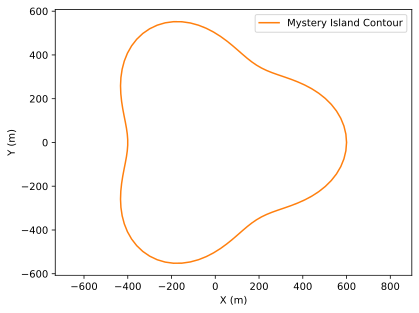
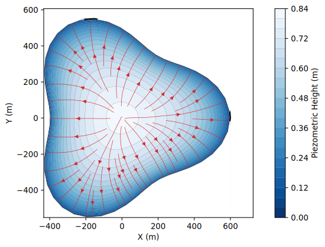
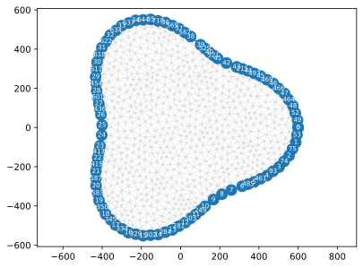
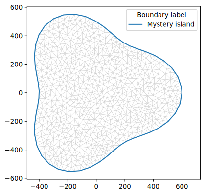
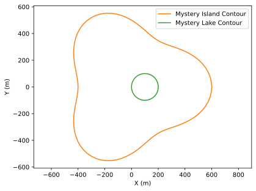
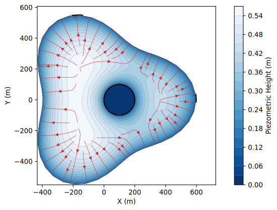

Tutorial
********

Simple Lens 
===========

Procedure
---------
The simplest way to model an island's freshwater lens using IslandsLib is to use the :code:`IslandLens()`
function that is meant to simplify FEM calculations in simple cases of Islands without river networks.

For example suppose we want to model the form of the water table of  the Mystery island fresh water lens.

    Mystery Island contour

There are tw four steps 

* We start by setting some values that will be passed to the main function as arguments namely the name of Island and the path to the file where the island contour is stored 

.. code:: python

    # Name of Island
    islands = 'Mystery island'

    # Path to filename containing contour
    fname = "../data/Examples/MysteryIsland.txt"

* Second, we set the sub sampling rate of the contour. Often the contours are far too precise for FEM computation at the scale of an entire island. 
by default the sub sampling rate is 10 but in the case of Desirade a sampling rate of 50 is used. 

.. code:: python

    #sub sampling
    sub_sampling = 2

.. warning::

    If the contour is complex and the sub sampling rate too low the triangulation will probably fail. 
    This most often comes from the fact that nodes are too close to one another.

* Third, we define the parameters of the Triangulation

.. code:: python

    # Triangulation settings
    ttype = 'pq33a1000'

The string ``ttype``  is composed of three caracters p, q, and a followed by numbers the meaning of which is as follows

   *  p: we are making a planar straight line graph (a collection of segments and vertices);
   *  q: we are (inasmuch as possible) imposing a constraint of 33° angle for the triangles (equilateral triangles);
   *  a: the area of the triangle is less or equal to 1000 :math:`m^2`. 

 There are other options and for more detail please refer to https://rufat.be/triangle/index.html

* Fourth, we set the recharge :math:`R` and Hydraulic conductivity :math:`K` that together make the poisson coefficient :math:`fi`.

.. code:: python

    # Parameters
    # Infiltration
    R  = 0.19 # m/year
    R = R / 365.25 # infiltration m/d
    # Conductivity
    K = 2.5e-5*86400 # conductivity m/d

    fi = 2 * R * 25 / K / 1025

.. warning::

    :math:`fi = \frac{2R(\rho_s-\rho_d)}{\langle K \rangle\rho_s}` is dimensionless so :math:`R` and :math:`K` 
    have to be given in the same units (meters per day prefered see below).
  
* Eventually once all the parameters have been set we call the :func:`IslandLens` function and pass our parameters as arguments.

.. code:: python 

    u, Th, X, Y, Zm, dx, dy, itp = il.IslandLens( islands = islands, fname = fname,\
        ttype = ttype, fi = fi, sub_sampling = sub_sampling , clockwise = clockwise,\
        lakes= [], plot=True)

Visual outputs are stored in pdf files. They include 

* A plot of the solution for the water table and sample streamlines

    Modeled Water table of Myster Island 

* A map of the mesh produced by triangle with boundary nodes

    Triang Mesh

* The same mesh converted to FreeFem

    FreFem Mesh

Mass Balance of the Lens 
------------------------

 if you wish to produce a csv output with the lens caracteristics (volume, area, recharge) you can use the :code:`IslandBalance()` function 

.. code:: python 

    il.IslandBalance("Mystery", Zm, dx, dy, R, K)

which will output a csv file with the input parameters, recharge, conductivity, porosity and the calculated lens volume, area and 
volumetric recharge.

.. note::

    For the time being :math:`R` and :math:`K` must be given in meters / day

Comments
--------

* Coordinates must be in metric units (hence UTM for most cases). If you use latitudes and longitudes the modeling will probably work but as the x- and y-distances are not conserved the results will be flawed.
* Note that in the case of Mystery island we used realistic values for conductivity taken from the Marie Galante island in Guadeloupe.
* For a first try you can set `ttype` to `pq33` before adding an areal constraint. If your area is too small the number of triangles will be to high and the mesh generation will fail

The full script is given below

.. literalinclude:: ../../examples/SimpleLens.py
    :language: python 
    :linenos:

Island with a lake 
==================

Let us now add a lake to ou Mystery Island. The lake is at see level hence its elevation is 0 meter above sea level.

    Mystery Island an lake

As for the simple lens we start by defining the parameters before calling :func:`IslandLens`. 
First we define the contour names and file locations 

.. code:: python 

    import matplotlib.pyplot as plt

    import IslandsLib as il

    #####################
    # Set arguments
    #####################

    # Name of Island and path to contour
    islands = 'Mystery Island'
    island_fname = "../data/Examples/MysteryIsland.txt"

    # Name of lake and path to contour
    lake = "Mystery Lake"
    lake_fname = "../data/Examples/MysteryLake.txt"

Because :func:`IslandLens` can handle multiple lakes  we creat a lake list called lakes and popualte it with our lake

.. code:: python

    lakes = [[lake, lake_fname, 0]] # list of lakes with file name and elevation of lake (masl)

We proceed with the parameters need to solve the Poisson equation hence 

* contour sub_sampling, 
* Recharge and Conductvity 
* Poisson coefficient 

.. code:: python 

    #sub sampling
    sub_sampling = 2

    #clockwise
    clockwise = False

    # Triangulation settings
    ttype = 'pq33a1000'

    # Parameters
    # Infiltration
    R  = 0.19 # m/year
    R = R / 365.25 # infiltration m/d
    # Conductivity
    K = 2.5e-5*86400 # conductivity m/d

    fi = 2 * R * 25 / K / 1025

With all this set we can call :func:`IslandLens`

.. code:: python

    u, Th, X, Y, Zm, dx, dy, itp = il.IslandLens( islands = islands, fname = island_fname, lakes = lakes, ttype = ttype,  fi = fi , sub_sampling = sub_sampling, clockwise = clockwise, plot = True)

The resulting water table shows the influence of the lake on the water table and flow. 
If you compare to the same island without lake it is clear that lakes can be of tremendous influence as the impose internal
boundary conditions that constrain the solution.

