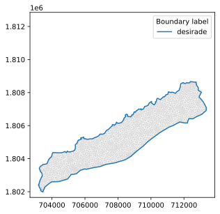

A simple freshwater lens
========================

Procedure
---------
The simplest way to model an island's freshwater lens using IslandsLib is to use the ``IslandLens()``
function that is meant to simplify FEM calculations in simple cases of Islands without river networks.

For example suppose we want to model the form of the the Desirade island fresh water lens in the French Antilles Guadeloupe Department.
there are two steps 

* We start by setting some values that will be passed to the main function as arguments namely the name of Island and the path to the file where the island contour is stored 

.. code:: python

    # Name of Island
    islands = 'Desirade'

    # Path to filenmae containing contour
    fname = "../data/Desirade.txt"

* Second, we set the sub sampling rate of the contour. Often the contours are far too precise for FEM computation at the scale of an entire island. 
by default the sub sampling rate is 10 but in the case of Desirade a sampling rate of 50 is used. 

.. code:: python

    #sub sampling
    sub_sampling = 50

.. warning::

    If the contour is complex and the sub sampling rate too low the triangulation will probably fail 

* Third, we define the parameter of the triangulation. 

.. code:: python

    # Triangulation settings
    ttype = 'pq33a10000'

The string ``ttype``  is composed of three caracters p, q, and a followed by numbers the meaning of which is as follows

   *  p: we are making a planar straight line graph (a collection of segments and vertices);
   *  q: we are imposing a constraint of 33° angle for the triangles (equilateral triangles);
   *  a: the area of the triangle is less or equal to 10000 :math:`m^2`. 

 There are other options and for more detail please refer to https://rufat.be/triangle/index.html

* Fourth, we set the recharge :math:`R` and Hydraulic conductivity :math:`K` that together make the poisson coefficient :math:`fi`.

.. code:: python

    # Poisson coefficient
    # 2 Delta\rho/\rho R/K
    # densities
    rho = 1000 # freshwater
    rhos = 1025 # saltwater
    R = 0.19 # recharge m/year
    R = R / 365.25 / 86400 # recharge m/s
    K = 2.5e-5 # conductivity m/s

    fi = 2*R*(rhos-rho)/K/rhos

.. warning::

    :math:`fi = \frac{2R(\rho_s-\rho_d)}{\langle K \rangle\rho_s}` is dimensionless so :math:`R` and :math:`K` have to be given in the same units
  
* Eventually we call the IslandLens function and pass the arguments.

.. code:: python 

    u, Th = il.IslandLens( islands, fname, ttype, fi, sub_sampling )

At the end you can add ``plt.show()`` to visualize the results (l.27). 

Visual outputs include 

* A plot of the solution for the water table and sample streamlines

.. figure:: ./figures/PhiPlot.svg

* A map of the mesh produced by triangle with boundary nodes

.. figure:: ./figures/triangleMesh.svg

* The same mesh converted to FreeFem

Comments
--------

* Coordinates must be in metric units (hence UTM for most cases). If you use latitudes and longitudes x- and y-distances are not conserved.
* Note that in the case of Desirade we used values for conductivity form the nearby Marie Galante island, as there are not surveys on Desirade.
* For a first try you can set `ttype` to `pq33` before adding an areal constraint. If your area is too small the number of triangles will be to high and the mesh generation will fail

The full script is given below

.. literalinclude:: ../../examples/SimpleLens.py
    :language: python 
    :linenos:
